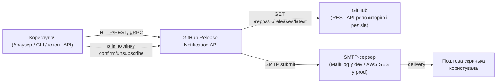
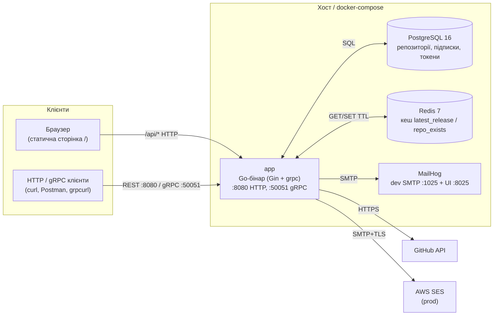
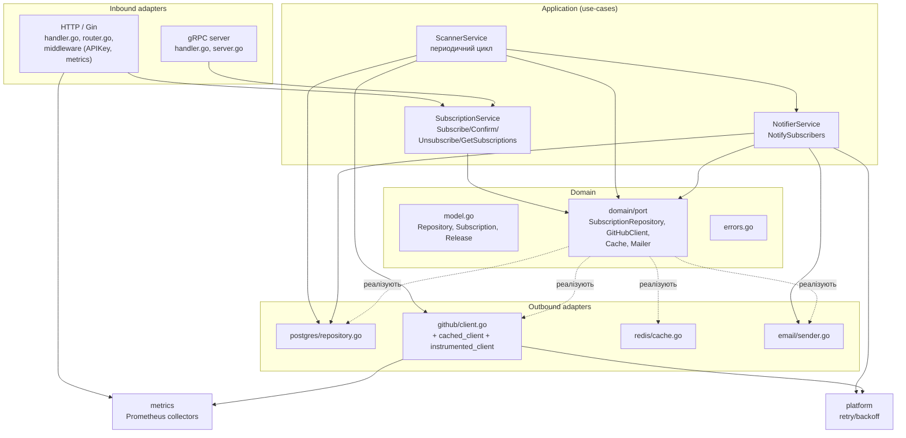
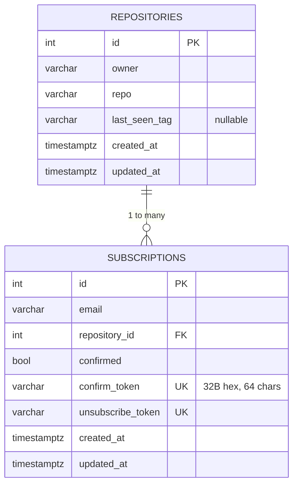
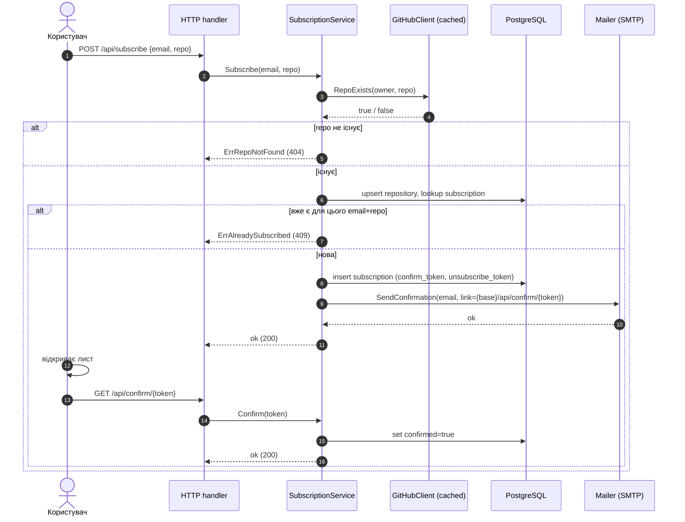
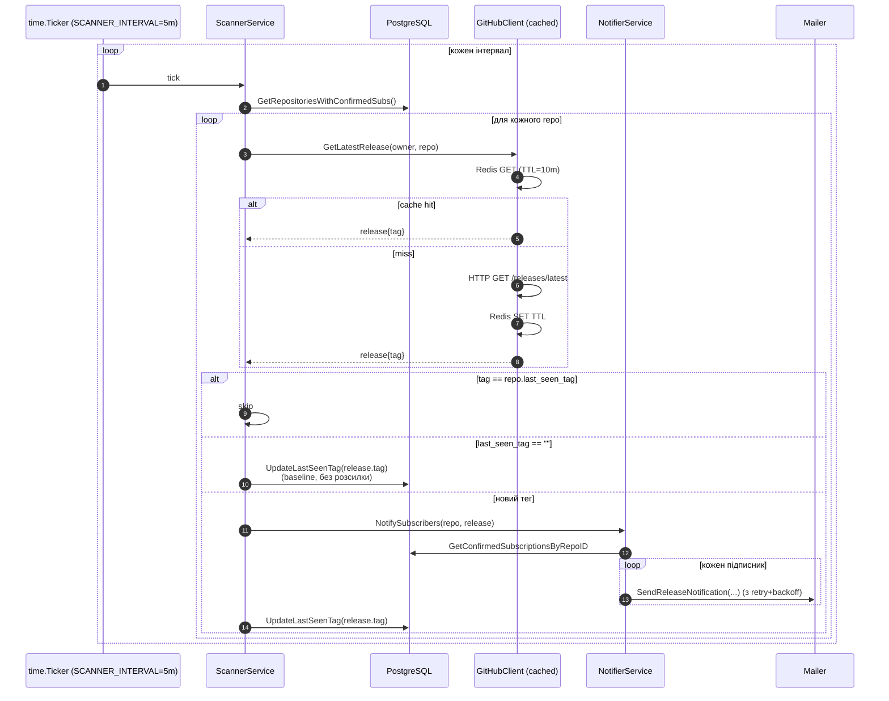
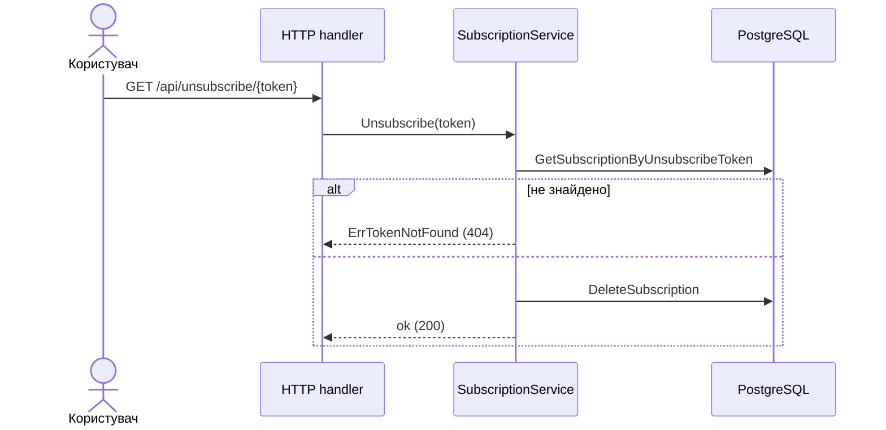

# System Design — GitHub Release Notification API

> Документ описує архітектуру сервісу: що він робить, з чого складається, як рухаються дані, які компроміси прийняті й куди система може еволюціонувати. Конкретні архітектурні рішення з мотивацією — у [`adr/`](adr/).

## 1. Призначення

Сервіс дозволяє користувачу **підписатися на email‑сповіщення про нові релізи** обраного публічного GitHub‑репозиторію. Користувач підтверджує підписку через лист, після чого фоновий сканер періодично опитує GitHub API і, виявивши новий тег, надсилає лист‑сповіщення з посиланням на реліз і токеном відписки.

### Функціональні можливості

- `POST /api/subscribe` — створити підписку (`email`, `repo` у форматі `owner/name`).
- `GET /api/confirm/{token}` — підтвердити підписку.
- `GET /api/unsubscribe/{token}` — відписатися.
- `GET /api/subscriptions?email=...` — переглянути підписки конкретного email.
- gRPC‑аналоги тих самих чотирьох операцій (сервіс `subscription.SubscriptionService`).
- Фоновий сканер релізів і відсилання повідомлень.
- Метрики Prometheus, готова OpenAPI‑специфікація, статична HTML‑сторінка‑демо.

### Нефункціональні цілі

- Надійність доставки листів важливіша за «миттєвість» — допускається затримка до одного інтервалу сканування (за замовчуванням 5 хв).
- Стійкість до короткочасних збоїв GitHub/SMTP (retry + кеш).
- Економія GitHub rate‑limit (кеш `latest_release`).
- Простий локальний запуск (`docker compose up`).

## 2. Контекст системи (C4 Level 1)

## 3. Контейнери (C4 Level 2)

### Внутрішні модулі (гексагональна архітектура — див. [ADR-0001](adr/0001-hexagonal-architecture.md))

## 4. Модель даних

Дві таблиці у PostgreSQL (див. `migrations/000001_init.up.sql`).

Унікальність та індекси:

- `UNIQUE(owner, repo)` — один запис на репозиторій.
- `UNIQUE(email, repository_id)` — повторна підписка → 409 (див. [ADR-0007](adr/0007-token-based-confirmation.md)).
- `UNIQUE(confirm_token)`, `UNIQUE(unsubscribe_token)` — одноразові, непригадувані токени.
- Індекси на `email`, `confirmed=TRUE`, на обидва токени (швидкий lookup за лінком).

## 5. Основні потоки

### 5.1. Підписка та підтвердження

Якщо лист не відправився — підписка **відкочується** (`DeleteSubscription`) і клієнт отримує 5xx. Це гарантує, що в БД немає «зомбі‑підписок» без листа.

### 5.2. Цикл сканера релізів

Особливості:

- **Сканер опитує GitHub лише для тих репо, де є confirmed‑підписки** — менше зайвих запитів.
- **Перший виявлений реліз** не розсилається: він стає baseline (інакше при новій підписці на репо з історією прилетіли б «фейкові» сповіщення).
- **Кеш `latest_release`** з TTL зменшує частоту звернень до GitHub; компроміс — затримка виявлення нового тегу до `SCANNER_INTERVAL + GITHUB_CACHE_TTL` (див. [ADR-0004](adr/0004-redis-cache-for-github.md)).
- Якщо Redis недоступний — лог‑warning, кеш вимикається, прямі HTTP‑дзвінки до GitHub.
- Email‑відправка обернена в експоненційний backoff (`platform.RetryConfig`, transient errors only).

### 5.3. Відписка

## 6. Конфігурація і середовища

Всі параметри керуються через ENV (див. `internal/config/config.go`):

| Група    | Ключі (приклади)                                                   | За замовчуванням                                       |
| -------- | ------------------------------------------------------------------ | ------------------------------------------------------ |
| Server   | `SERVER_PORT`, `*_TIMEOUT`                                         | `8080`, 15s/15s/60s                                    |
| DB       | `DB_HOST/PORT/USER/PASSWORD/NAME`, `DB_QUERY_TIMEOUT`              | localhost/5432/postgres/postgres/releases, 5s          |
| Redis    | `REDIS_ADDR`, `REDIS_DB`, `REDIS_*_TIMEOUT`                        | localhost:6379                                         |
| SMTP     | `SMTP_HOST/PORT/USER/PASSWORD/FROM/TIMEOUT`                        | localhost:1025 (MailHog у docker-compose)              |
| GitHub   | `GITHUB_TOKEN`, `GITHUB_BASE_URL`, `GITHUB_CACHE_TTL`              | `https://api.github.com`, 10m                          |
| Scanner  | `SCANNER_INTERVAL`, `SCANNER_CYCLE_TIMEOUT`, `SCANNER_REPO_TIMEOUT`| 5m, 4m, 30s                                            |
| gRPC     | `GRPC_PORT`                                                        | 50051                                                  |
| Auth     | `API_KEY`                                                          | пусто (опційний middleware)                            |
| Logging  | `LOG_LEVEL`                                                        | info (slog JSON)                                       |

Середовища:

- **Local dev** — `docker-compose.yml` піднімає `app + postgres + redis + mailhog`. `SMTP_USER/PASSWORD` примусово порожні, бо `net/smtp` Go не дозволяє `PLAIN AUTH` по нешифрованому з’єднанню.
- **Prod** — `docker-compose.prod.yml`, реальні секрети через ENV‑файл або менеджер секретів. Інфраструктура AWS — у `terraform/` (VPC, RDS PostgreSQL, ElastiCache Redis, EC2, SES — за потреби).

## 7. Спостережуваність

- **Логи** — `slog` у JSON, рівень керується `LOG_LEVEL`.
- **Метрики Prometheus** на `/metrics`:
  - `http_requests_total{method,path,status}`, `http_request_duration_seconds`,
  - `github_api_calls_total{endpoint,status}`,
  - `emails_sent_total{type,status}`,
  - `active_subscriptions`, `scan_cycles_total`.
- **Health‑check** — фактично HTTP `200 /` достатньо для поточних потреб; за потреби додасться `/healthz` із пінгом БД/Redis.

## 8. Безпека

- **Автентифікація API (опційна).** Якщо `API_KEY` непорожній, middleware `APIKeyAuth` вимагає заголовок `X-API-Key`. Без значення — публічні ендпоінти (для веб‑демо).
- **Токени.** `confirm_token` і `unsubscribe_token` — 32 байти з `crypto/rand`, hex‑encoded (64 символи), `UNIQUE` у БД, не вгадуються brute‑force за прийнятний час.
- **GitHub Token (опційний).** Без токена rate‑limit різко обмежений; токен передається лише в `Authorization: Bearer ...` до `api.github.com`.
- **SMTP.** У prod очікується TLS (порт 587 + STARTTLS); код вмикає `STARTTLS` якщо сервер його повідомляє.
- **Postgres / Redis.** У docker‑compose не виставлені назовні без потреби; у prod — у приватній мережі (Terraform VPC).
- **CORS.** Не налаштовано (єдиний клієнт — статична сторінка з того самого хоста). Якщо знадобиться зовнішній фронт — додати middleware.

## 9. Надійність і стійкість

- **Retry з експоненційним backoff** (`internal/platform/retry.go`) для:
  - HTTP‑дзвінків до GitHub (`max_retries=3`, jitter ±25%);
  - SMTP‑відправки (тільки transient errors: `dial`, `timeout`, `EOF`, `reset`, …).
- **Кеш як graceful degradation:** Redis недоступний → попередження в лог, прямий HTTP без падіння.
- **Контексти і таймаути** скрізь: `cycleCtx` для всього циклу сканера, `repoCtx` на репо, окремі таймаути на DB‑запит, SMTP, HTTP.
- **Graceful shutdown:** `SIGINT/SIGTERM` → `context.Cancel` для сканера, `httpServer.Shutdown`, `grpcServer.GracefulStop`, ліміт `SHUTDOWN_TIMEOUT`.

## 10. Ризики й майбутня еволюція

| Ризик / обмеження                                                    | Поточна позиція                                              | Можливий розвиток                                                    |
| -------------------------------------------------------------------- | ------------------------------------------------------------ | -------------------------------------------------------------------- |
| Polling замість push → затримка виявлення релізу                     | Допустима (5–15 хв, див. [ADR-0002](adr/0002-polling-vs-webhooks.md)) | GitHub Webhooks для public репо з підпискою «releases»; require Webhook secret |
| Один інстанс сканера → всі цикли в одному процесі                    | OK поки число confirmed‑repos невелике                       | Виносити сканер у окремий деплой; шардинг репозиторіїв; черга задач  |
| Email‑відправка синхронно у циклі сканера                            | Простіше, retry на місці                                     | Винести в чергу (NATS/Kafka/RabbitMQ); окремий worker для розсилки   |
| Rate‑limit GitHub                                                    | Кеш + опційний токен                                         | Conditional requests (ETag / `If-None-Match`); GraphQL для bulk      |
| Кеш «застарілий» = пізніше сповіщення                                | Свідомий компроміс (TTL 10 хв)                               | Зменшити TTL для популярних репо; інвалідація після виявлення        |
| Немає health/readiness endpoints                                     | Достатньо для compose                                        | Додати `/healthz`, `/readyz` з пінгом залежностей                    |
| Один регіон/моноліт                                                  | Простота                                                     | Multi‑region deploy, RDS read replica, distributed cache             |

---

Останні оновлення: див. історію Git у `docs/`.
